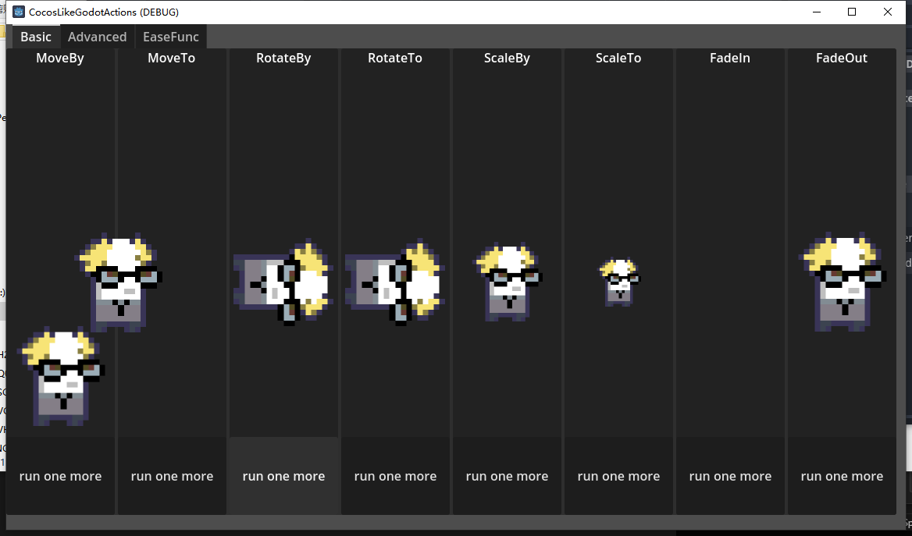
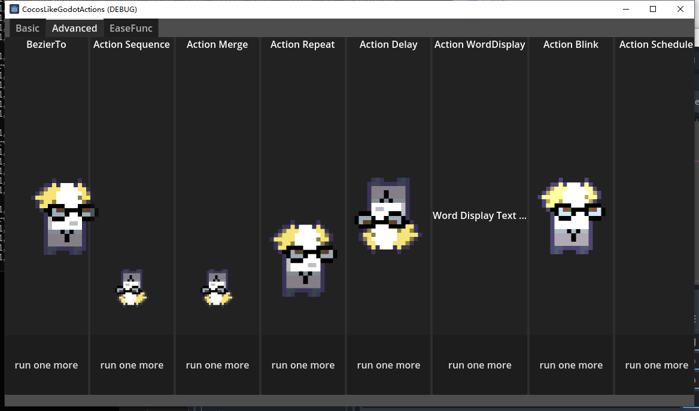
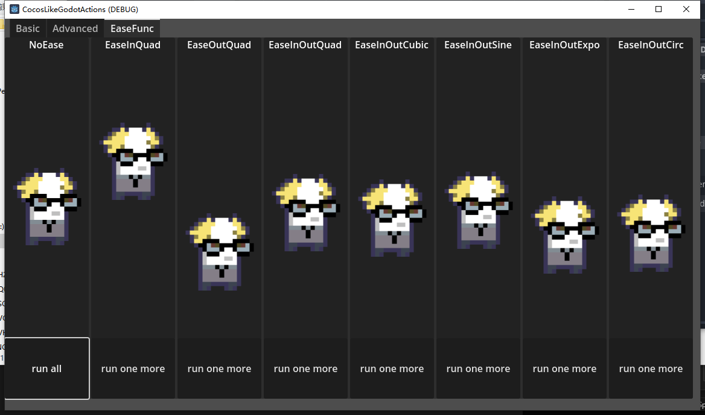

# CocosLikeGodotActions
This is a group of  simple 2d animations similar with cocos2dx actions ，you can build animation only in a few lines of code .
Including  action sequence,merge and ease.

# Code Example
```GDScript
Actions.MoveBy.new(Vector2(0,300),1.0).run(node)
```

Actions preview
<p align='center'>
</img>
</p>
<p align='center'>
</img>
</p>
Group of ease actions
<p align='center'>
</img>
</p>